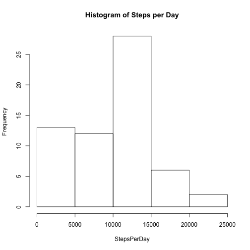
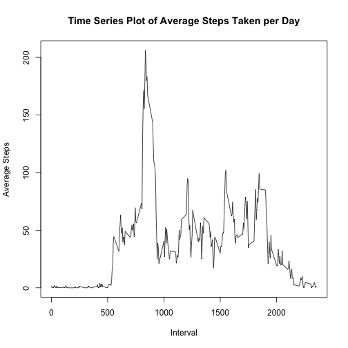
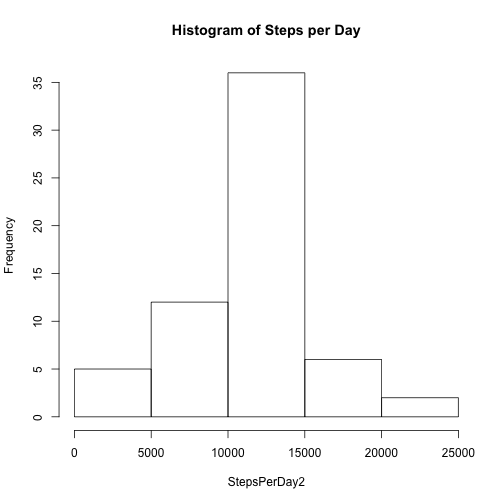
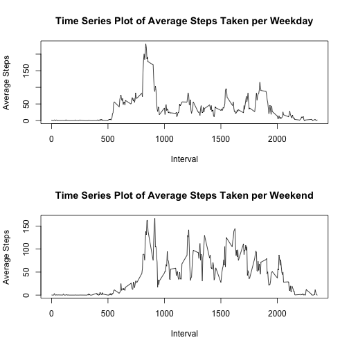

Monitoring Personal Activity
============================

An individual's personal movement is recorded by taking the number of steps 
taken in five minute intervals throughout the course of two months (Oct. and 
Nov. 2012).


## Loading and preprocessing the data

First you will have to download the [Activity monitoring data] (https://d396qusza40orc.cloudfront.net/repdata%2Fdata%2Factivity.zip) from the course website.

After setting your directory and placing the csv file in the desired directory, read in the downloaded csv file.


```r
Activity <- read.csv("activity.csv")
```


## Mean total number steps taken per day

Ignoring the missing values of the dataset, we can take a look at the total number of steps taken each day.

```r
StepsPerDay <- tapply(Activity$steps, Activity$date, FUN=sum, na.rm=TRUE)

hist(StepsPerDay, main = "Histogram of Steps per Day")
```

 

```r
StepsVector <- as.vector(tapply(Activity$steps, Activity$date, FUN=sum))

Mean <- mean(StepsVector, na.rm=TRUE)

Median <- median(StepsVector, na.rm=TRUE)
```
Looks like the mean steps per day is 1.0766189 &times; 10<sup>4</sup> and the median is 10765


## Average Daily Activity

To visualize this data, let's plot the number of steps taken for each 5 minute
interval, averaged across all days.

```r
TimeSeries <- as.data.frame(tapply(Activity$steps, Activity$interval, FUN=mean, na.rm=TRUE))

TimeSeries <- cbind(TimeSeries,as.numeric(rownames(TimeSeries)))

colnames(TimeSeries) <- c("Steps", "Interval")

rownames(TimeSeries) <- 1:length(TimeSeries$Steps)

plot(TimeSeries$Interval, TimeSeries$Steps, type="l", main = "Time Series Plot of Average Steps Taken per Day", xlab = "Interval", ylab = "Average Steps")
```

 

To get the maximum number of steps taken we can subset as seen below

```r
MaxSteps <- TimeSeries[TimeSeries$Steps==max(TimeSeries$Steps),]
MaxStepsNumber <- MaxSteps[1]
MaxStepsInterval <- MaxSteps[2]
MaxSteps
```

```
##        Steps Interval
## 104 206.1698      835
```
Where the Maximum number of steps are 206.1698113 on the interval labeled 835


## Imputting Missing Values

As missing values create a bias in the data, a method of filling in those 
missing values may be implemented to make the data more accurate.  First,
let's take a look at how many "NAs" we have in our data.

```r
NASum <- sum(is.na(Activity[,1]))
```
There seems to be 2304 missing values in the data.

Next, we will be replacing the missing values with the mean value, averaged across all days, 
for the corresponding time interval.  With this new data set we can then visualize
and report the mean and median as we did with the original dataset.

```r
Activity2 <- Activity

Activity2[is.na(Activity2),1] <- rep(TimeSeries$Steps, times=sum(is.na(StepsVector)))

StepsPerDay2 <- tapply(Activity2$steps, Activity2$date, FUN=sum)

hist(StepsPerDay2, main = "Histogram of Steps per Day")
```

 

```r
StepsVector2 <- as.vector(tapply(Activity2$steps, Activity2$date, FUN=sum))

mean(StepsVector2, na.rm=TRUE)
```

```
## [1] 10766.19
```

```r
median(StepsVector2, na.rm=TRUE)
```

```
## [1] 10766.19
```
The filling in of the missing values using averaged values for the time intervals,
brings the data closer to the center, with the mean and median being equal now.


## Weekdays vs. Weekends

To see the differences in number of steps taken from the weekdays and weekends,
we will start by adding a variable that will identify if an observation is 
taken during the weekday or if it was taken during the weekend.

```r
##Turn the date variable in Activity2(activity.csv data with the NA's filled in),
##into the class 'date'
Activity2$date <- as.Date(Activity2$date, "%Y-%m-%d")

##Add a column to identify what day the observation was in
Activity2 <- cbind(Activity2, day = weekdays(Activity2$date))

## Label "Weekend" or "Weekday" using the new variable
Activity2$day <- as.character(Activity2$day)
Activity2$day[Activity2$day=="Saturday"|Activity2$day=="Sunday"] <- "Weekend"
Activity2$day[Activity2$day!="Weekend"] <- "Weekday"
```

A panel plot may now be generated to see the time series plot of the 5-minute 
interval and the average number of steps taken (averaged across all weekdays or
weekend days).

```r
Weekday <- Activity2[Activity2$day=="Weekday",]
Weekend <- Activity2[Activity2$day=="Weekend",]

TimeSeriesWeekday <- as.data.frame(tapply(Weekday$steps, Weekday$interval, FUN=mean, na.rm=TRUE))

TimeSeriesWeekday <- cbind(TimeSeriesWeekday,as.numeric(rownames(TimeSeriesWeekday)))

colnames(TimeSeriesWeekday) <- c("Steps", "Interval")

rownames(TimeSeriesWeekday) <- 1:length(TimeSeriesWeekday$Steps)


TimeSeriesWeekend <- as.data.frame(tapply(Weekend$steps, Weekend$interval, FUN=mean, na.rm=TRUE))

TimeSeriesWeekend <- cbind(TimeSeriesWeekend,as.numeric(rownames(TimeSeriesWeekend)))

colnames(TimeSeriesWeekend) <- c("Steps", "Interval")

rownames(TimeSeriesWeekend) <- 1:length(TimeSeriesWeekend$Steps)

par(mfrow=c(2,1))

plot(TimeSeriesWeekday$Interval, TimeSeriesWeekday$Steps, type="l", main = "Time Series Plot of Average Steps Taken per Weekday", xlab = "Interval", ylab = "Average Steps")

plot(TimeSeriesWeekend$Interval, TimeSeriesWeekend$Steps, type="l", main = "Time Series Plot of Average Steps Taken per Weekend", xlab = "Interval", ylab = "Average Steps")
```

 
